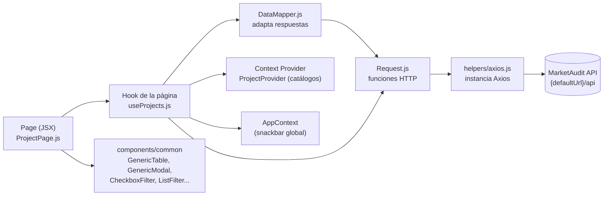

# MarketAudit Frontend

Backoffice web de **MarketAudit**, plataforma de auditoría de puntos de venta (PDV). Desde esta aplicación el equipo interno administra clientes, usuarios y proyectos de auditoría, carga cuestionarios y PDVs mediante planillas Excel, consulta el informe de auditoría con las respuestas de los censistas y descarga las fotos relevadas.

> Este documento se generó a partir del análisis del código del repositorio. Cuando algo no puede determinarse desde el código se indica con ⚠️.
> El funcionamiento del backend (reglas de negocio, base de datos, endpoints) está documentado en el README del repositorio **`marketaudit`** (Backend).

---

## Índice

1. [Descripción](#1-descripción)
2. [Stack tecnológico](#2-stack-tecnológico)
3. [Arquitectura Frontend](#3-arquitectura-frontend)
4. [Estructura del proyecto](#4-estructura-del-proyecto)
5. [Navegación y routing](#5-navegación-y-routing)
6. [Módulos / Features](#6-módulos--features)
7. [Comunicación con Backend](#7-comunicación-con-backend)
8. [Estado](#8-estado)
9. [Autenticación](#9-autenticación)
10. [Configuración](#10-configuración)
11. [Cómo ejecutar el Frontend](#11-cómo-ejecutar-el-frontend)
12. [Build](#12-build)
13. [Testing](#13-testing)
14. [Deployment](#14-deployment)
15. [Troubleshooting](#15-troubleshooting)
16. [Guía rápida para desarrolladores](#guía-rápida-para-desarrolladores)
17. [Getting Started del ecosistema completo](#getting-started-del-ecosistema-completo)
18. [Observaciones y posibles bugs detectados](#observaciones-y-posibles-bugs-detectados)

---

## 1. Descripción

MarketAudit organiza relevamientos de campo:

- Un **cliente** contrata un **proyecto** de auditoría.
- El proyecto tiene un **cuestionario** (preguntas con tipos, respuestas posibles y lógica de salto) y un listado de **PDVs** agrupados en **rutas**, cada ruta asignada a un **censista**.
- Los censistas responden desde una aplicación móvil Android (repositorio `marketaudit-app`) y el backend guarda las respuestas y fotos (URLs en Amazon S3).

**Responsabilidad de este Frontend (backoffice):**

| Funcionalidad | Pantalla |
|---|---|
| Iniciar/cerrar sesión | Login, barra superior |
| ABM de clientes | Clientes |
| ABM de usuarios (incluye censistas, responsables y usuarios de prueba) | Usuarios |
| ABM de proyectos, cambio de estado, eliminación de PDVs duplicados | Proyectos |
| Carga masiva de PDVs y preguntas (Excel) y consulta de lo cargado | Proyectos → Cargar |
| Informe de auditoría (respuestas por PDV) y exportación a Excel | Informe de auditoria |
| Galería de fotos filtrable y descarga en ZIP | Portal de Fotos |
| Visor de logs del backend por fecha | Logs |

No implementa la experiencia del censista: esa es la app móvil que consume otros endpoints del mismo backend.

---

## 2. Stack tecnológico

Versiones declaradas en `package.json` (entre paréntesis, la versión resuelta en `package-lock.json`).

| Tecnología | Versión | Uso |
|---|---|---|
| React / React DOM | `^16.12.0` (16.14.0) | UI |
| Create React App (`react-scripts`) | `5.0.1` | Build, dev server, tests (Jest), ESLint |
| React Router DOM | `^5.1.2` (5.3.4) | Routing (`BrowserRouter`, `Switch`, `Route`) |
| Material-UI v4 | `@material-ui/core ^4.9.2` (4.12.4), `icons`, `lab`, `pickers` | Componentes, tema, date pickers |
| `@date-io/date-fns` + `date-fns` | `^1.3.13` / `^2.9.0` | Adaptador de fechas para los pickers |
| Axios | `^0.19.0` (0.19.2) | Cliente HTTP |
| `file-saver` | `^2.0.2` | Descarga de Excel/ZIP |
| `material-ui-dropzone` | `^3.0.0` | Selección de archivos (Excel, imagen de cliente) |
| Sass | `^1.69.5` | Estilos `.scss` por página/componente |
| Testing Library | `@testing-library/react ^9.3.3`, `jest-dom ^4.2.4`, `user-event ^7.1.2` | Tests |
| Lenguaje | JavaScript (JSX), sin TypeScript | |

`emoji-picker-react` está declarado pero no se encontraron usos en `src/`.

---

## 3. Arquitectura Frontend

SPA de Create React App organizada **por página/feature**. Cada feature repite el mismo patrón:



| Pieza | Responsabilidad |
|---|---|
| `Request.js` | Una función por endpoint (método, URL, params/body). Sin lógica. |
| `DataMapper.js` | Llama a `Request` y devuelve `response.data` o lo transforma (p. ej. a `{key, value}` para filtros). |
| `use*.js` (hooks) | Estado de la página, handlers de botones, apertura de modales/diálogos, mensajes de éxito/error. |
| `*Page.js` | Composición visual con componentes comunes de `components/common`. |
| `context/*` | Catálogos compartidos de una feature (estados, roles, responsables, "modelo vacío" para altas) y el snackbar global. |

Arranque (`src/index.js`): `ErrorBoundary` → `AppContextProvider` (snackbar) → `App` (`ThemeProvider` con `theme/theme.js`) → `MarketauditRouter`.

---

## 4. Estructura del proyecto

```text
marketaudit_fe/
├── .env                      # Flags de CRA (sin secretos)
├── jsconfig.json             # baseUrl "src" → imports absolutos (p. ej. 'helpers/axios')
├── package.json
├── public/
│   ├── index.html
│   ├── manifest.json
│   └── web.config            # Reglas de rewrite para IIS (SPA)
└── src/
    ├── index.js              # Punto de entrada
    ├── app/                  # App, router principal, rutas, ruta privada, cuerpo con las rutas del menú
    ├── Pages/                # Features (una carpeta por pantalla del menú)
    │   ├── Clients/
    │   ├── Users/
    │   ├── Projects/         # Grilla de proyectos + "administrar" (PDVs/preguntas)
    │   ├── Reports/          # Informe de auditoría
    │   ├── GridPhotos/       # Portal de fotos
    │   └── LogApp/           # Visor de logs
    ├── context/              # Providers por feature (clients, users, projects) + app (snackbar)
    ├── components/
    │   ├── auth/             # LoginPage + Request (login)
    │   ├── mainPage/         # Layout autenticado (Toolbar + Breadcrumbs + AppBody + SideBar)
    │   ├── common/           # Componentes reutilizables (tabla, modal, filtros, botones, pickers, sidebar, toolbar)
    │   ├── Hooks/            # useFilterHook
    │   └── home/             # HomePage/DashBoardMenuOption (no enrutados actualmente)
    ├── api/CommonRequest.js  # Descargas genéricas (Excel de informes, ZIP de fotos)
    ├── helpers/              # axios.js (cliente HTTP) y AuthenticationHelper.js (sesión en localStorage)
    ├── constants/            # constants.js (URL del backend, URL de S3), reportSettings.js
    ├── theme/                # Tema MUI y estilos por componente
    ├── error/                # ErrorBoundary y ErrorPage
    └── assets/img/           # Logos e imágenes
```

| Carpeta | Modificar cuando… |
|---|---|
| `src/app/Routes.js` | Se agrega una pantalla al menú lateral o una ruta. |
| `src/Pages/<Feature>/` | Cambia el comportamiento o la UI de una pantalla. |
| `src/context/<feature>/` | Cambian catálogos compartidos (estados, roles, responsables) o el modelo de alta. |
| `src/components/common/` | Cambia un componente reutilizado por varias pantallas (afecta a todas). |
| `src/helpers/axios.js` | Cambian headers, interceptores o base URL. |
| `src/constants/constants.js` | Cambia la URL del backend o del bucket de imágenes. |
| `src/theme/` | Cambian colores/estilos globales. |

---

## 5. Navegación y routing

Router: `react-router-dom` v5 con `BrowserRouter` (`src/app/MarketauditRouter.js`).

| Ruta | Tipo | Componente |
|---|---|---|
| `/` | Pública | Redirige a `/principal` |
| `/login` | Pública | `components/auth/LoginPage` |
| `/principal` | Privada | `MainPage` (layout; el cuerpo queda vacío porque no hay página para esta ruta) |
| *cualquier otra* | Privada | `MainPage` → `AppBody` renderiza la ruta del menú que coincida |

Rutas del menú (definidas en `menuRoutes` de `src/app/Routes.js`, cargadas con `React.lazy`):

| Ruta | Etiqueta en el menú | Componente |
|---|---|---|
| `/Reportes-categorias` | Informe de auditoria | `Pages/Reports/ReportPage` |
| `/Fotos` | Portal de Fotos | `Pages/GridPhotos/GridPhotosPage` |
| `/clientes` | Clientes | `Pages/Clients/ClientRouter` |
| `/proyectos` | Proyectos | `Pages/Projects/ProjectRouter` → `ProjectPage` |
| `/proyectos/administrar` | (sin ítem de menú) | `Pages/Projects/ProjectRouter` → `ManageProject` |
| `/usuarios` | Usuarios | `Pages/Users/UserRouter` |
| `/Log` | Logs | `Pages/LogApp/LogAppPage` |

- **Guard:** `src/app/PrivaterRoute.js` (`PrivateRoute`) renderiza la ruta si `isUserStored()` (existe `userId` en `localStorage`); si no, redirige a `/login`.
- **Layout autenticado:** `components/mainPage/MainPage.js` = `Toolbar` (botón de menú y botón de logout) + `BreadcrumbsRouter` + `AppBody` + `SideBar` (drawer generado desde `menuRoutes`; soporta ítems anidados con `nested: true`).
- **Roles:** no hay rutas ni menús condicionados por rol.

---

## 6. Módulos / Features

### 6.1 Login

- **Páginas:** `components/auth/LoginPage.js`.
- **Servicio:** `components/auth/Request.js → login()`.
- **Endpoint:** `POST /api/Auth/Login` con `{ User, Password }`.
- **Validación en UI:** usuario y contraseña con al menos 4 caracteres.

### 6.2 Clientes

- **Propósito:** ABM de clientes y habilitación/deshabilitación.
- **Archivos:** `Pages/Clients/ClientPage.js`, `useClients.js`, `DataMapper.js`, `Request.js`; `context/clients/ClientProvider.js`.
- **Endpoints:**

| Acción | Endpoint |
|---|---|
| Grilla (filtro por estado) | `POST /api/Customer/GetCustomers?states=` |
| Catálogo de estados | `POST /api/Customer/GetStates` |
| Modelo para alta / edición | `GET /api/Customer/GetNewCustomer`, `GET /api/Customer/GetCustomer?id=` |
| Guardar | `POST /api/Customer/Save` |
| Habilitar/deshabilitar | `POST /api/Customer/Enable` (body: array de ids) |
| Eliminar | `POST /api/Customer/Delete` (body: array de ids) |
| Exportar | `GET /api/Export/GetReport?report=customer` |

### 6.3 Usuarios

- **Propósito:** ABM de usuarios: nombre, apellido, usuario, contraseña, email, rol y marca **"Usuario de Prueba"** (los usuarios de prueba ven en la app los proyectos en estado *Creado*, para testear el cuestionario antes de aprobarlo).
- **Archivos:** `Pages/Users/*`, `context/users/UserProvider.js`.
- **Endpoints:** `POST /api/User/GetUsers?roles=&states=`, `POST /api/User/GetRoles`, `POST /api/User/GetStates`, `GET /api/User/GetNewUser`, `GET /api/User/GetUser?id=`, `POST /api/User/Save`, `POST /api/User/Enable`, `POST /api/User/Delete`, `GET /api/Export/GetReport?report=user`.
- Los **censistas** referenciados en la planilla de PDVs y los **responsables** de proyecto se gestionan aquí (el backend considera responsables a los usuarios con rol id 4).

### 6.4 Proyectos

**Grilla (`/proyectos`)** — `Pages/Projects/ProjectPage.js` + `useProjects.js`, catálogos en `context/projects/ProjectProvider.js`.

| Botón / acción | Endpoint | Notas |
|---|---|---|
| Carga de grilla (filtros Estado y Responsables) | `POST /api/Project/GetProjects?states=&responsables=` | |
| Catálogos | `POST /api/Project/GetStates`, `POST /api/Project/GetResponsables`, `GET /api/Project/GetNewProject` | En `ProjectProvider` |
| Nuevo / MODIFICAR | `GET /api/Project/GetProject?id=` → `POST /api/Project/Save` | Nombre, descripción, tipo, responsable, cliente, fechas (la UI ajusta fechas para que inicio ≤ fin) |
| HABILITAR/DESHABILITAR | `POST /api/Project/Enable` (body: `[id]`) | Si el backend responde `status: "Validation"` (faltan PDVs o preguntas) abre un diálogo que ofrece ir a cargarlos |
| ELIMINAR | `POST /api/Project/DeleteProject` | |
| Cargar | Navega a `/proyectos/administrar` | Guarda el proyecto seleccionado en `ProjectContext` |
| Eliminar PDVs duplicados | `POST /api/Project/DeleteDuplicatePdvs?projectId=` | |
| Exportar | `GET /api/Export/GetReport?report=project` | |

Estados de proyecto (del backend): **Creado (1)** → **Aprobado (2)** ↔ **Desaprobado (3)**.

**Administrar proyecto (`/proyectos/administrar`)** — `Pages/Projects/ManageProject.js` + `useMangeProjects.js` + `UploadModal.js` + `GenericProjectTable.js`. Dos pestañas: **PDVs** y **Preguntas**.

| Acción | Endpoint |
|---|---|
| Grilla de PDVs | `GET /api/Project/GetPdvByProjectId?id=` |
| Grilla de preguntas | `GET /api/Project/GetQuestionByProjectId?id=` |
| CARGAR PDVs (Excel) | `POST /api/Project/ImportPDV` — `multipart/form-data` con `pdvfile` e `id` |
| CARGAR PREGUNTAS (Excel) | `POST /api/Project/ImportQuestions` — `multipart/form-data` con `questionFile` e `id`. **Solo habilitado si el proyecto está en estado Creado (`stateId === 1`)**; reemplaza el cuestionario completo |
| Exportar PDVs / preguntas | `GET /api/Export/GetReport?report=pdvProject&id=` / `report=questionProject` |
| Descargar plantilla (en el modal de carga) | `GET /api/Project/GetPdvTemplate` / `GET /api/Export/GetQuestionTemplate` — ⚠️ **estos endpoints no existen en el backend** (el código tiene el comentario "REMPLAZAR POR RUTA DEL TEMPLATE") |

El formato de columnas de cada planilla Excel está documentado en el README del Backend (sección *Proyectos*).

### 6.5 Informe de auditoría (`/Reportes-categorias`)

- **Archivos:** `Pages/Reports/ReportPage.js`, `DataMapper.js`, `Request.js`; descarga en `api/CommonRequest.js`.
- **Flujo:** lista de proyectos a la izquierda (`GET /api/Project/GetProjectReports`) → al elegir uno, tabla con una fila por PDV relevado y una columna por pregunta (`GET /api/Project/GetReportByProjectId?id=`) → botón de descarga `GET /api/Export/GetReport?report=informe-auditoria&id=` (`reportSettings.informeAuditoria`).
- Los valores que son URLs de S3 se muestran como imágenes en `GenericTable`.

### 6.6 Portal de fotos (`/Fotos`)

- **Archivos:** `Pages/GridPhotos/GridPhotosPage.js`, `DataMapper.js`, `Request.js`; `components/common/table/GenericTablePhotos.js`.
- **Flujo:** elegir proyecto (`GET /api/Project/GetProjectReports`) → se cargan fotos (`GET /api/Project/GetPhotoByProjectId?id=&users=&pdvs=&routes=&questions=`) y filtros Censistas / PDVs / Rutas / Preguntas (`GET /api/Project/GetDataFilterPhoto?id=`) → aplicar filtros → descargar ZIP (`GET /api/Export/GetPhotos` con los mismos filtros, `responseType: 'blob'`).

### 6.7 Logs (`/Log`)

- **Archivos:** `Pages/LogApp/LogAppPage.js`, `useLogApp.js`, `DataMapper.js`, `Request.js`.
- **Endpoint:** `GET /api/LogApp/GetByDate?date=yyyy-M-d`. Muestra el archivo de log **del backend** para la fecha elegida (columnas Hora, Tipo, Descripción).

### Relación pantalla ↔ backend (resumen)

```text
Pantalla                  Servicio FE                         Endpoint                               Lógica backend
─────────────────────────────────────────────────────────────────────────────────────────────────────────────────────────
Login                     components/auth/Request.login       POST /api/Auth/Login                   AuthService (SHA-256 vs tabla User)
Proyectos › Habilitar     Pages/Projects/Request.toggleEnable POST /api/Project/Enable               ProjectService.Enable (máquina de estados)
Proyectos › Cargar PDVs   Pages/Projects/Request.importPdvs   POST /api/Project/ImportPDV            NPOI + ProjectService.SavePdvs → Route/Pdv/Routes_Pdvs
Proyectos › Cargar Preg.  Pages/Projects/Request.importQuestions POST /api/Project/ImportQuestions    NPOI + ProjectService.SaveQuestions → Question/Response/Logic
Informe de auditoría      Pages/Reports/Request               GET /api/Project/GetReportByProjectId  ProjectService (tabla Project_{id} o Report_Master/Detail)
Portal de fotos › ZIP     api/CommonRequest.getReportPhotos   GET /api/Export/GetPhotos              Descarga imágenes de S3 y arma ZIP
```

---

## 7. Comunicación con Backend

- **Cliente HTTP:** instancia única de Axios en `src/helpers/axios.js`, importada por todos los `Request.js`.
- **Base URL:** `${defaultUrl}/api`, con `defaultUrl` **hardcodeado** en `src/constants/constants.js` (actualmente apunta a un ambiente de test remoto; hay una línea comentada para `https://localhost:44305`). No se usan variables de entorno para la URL.
- **Headers:** `userId` y `userName` leídos de `localStorage` **al momento de cargar el módulo** (no se actualizan tras el login hasta recargar la página). El backend los usa solo para logging.
- **Interceptors:** request/response definidos pero sin lógica (devuelven la config/respuesta o rechazan el error).
- **Autenticación:** no se envía ningún token (el backend no lo requiere).
- **Convenciones de contrato:**
  - Respuestas `ResponseData`: `{ message, status, data }`. Los errores de negocio llegan con **HTTP 200** y `status: "Error"`; los hooks verifican `response.data.status` (`'Ok'`, `'OK'` o `'Validation'` según el endpoint).
  - Grillas: `{ columns: [...], data: [...] }` que consume directamente `GenericTable`.
  - Errores HTTP 500: `{ message }`; algunos hooks muestran `e.response.data.message` en el snackbar.
  - Varias consultas usan `POST` con parámetros en query string, y las acciones masivas envían un array de ids en el body.
- **Uploads:** `FormData` con `Content-Type: multipart/form-data` (importación de Excel).
- **Downloads:** `responseType: 'blob'` + `file-saver` (`.xlsx`, `.csv` como nombre en algunas exportaciones aunque el backend devuelve xlsx, y `.zip`).
- **Imágenes:** URLs públicas de `https://weask-images.s3.amazonaws.com` (`amazonImagesUrl`) que se renderizan directamente.
- No hay WebSockets, polling ni refresh tokens.

---

## 8. Estado

No se usa Redux ni otra librería de estado global. La estrategia es:

| Nivel | Implementación | Contenido |
|---|---|---|
| Global | `context/app/AppContextProvider.js` (`AppContext`) | `openSnackbar(msg, variant)` para notificaciones |
| Por feature | `ClientProvider`, `UserProvider`, `ProjectProvider` (React Context, montados en el router de cada página) | Catálogos (estados, roles, responsables), modelo vacío para altas; en proyectos también el proyecto seleccionado (`projectEditId`, `projectToEdit`) para la pantalla *administrar* |
| Local | `useState` en hooks `use*.js` y páginas | Datos de grillas, filtros seleccionados, modales, loading |
| Persistente | `localStorage` (`userId`, `userName`) | Sesión |

Como el proyecto seleccionado vive en `ProjectContext`, **recargar `/proyectos/administrar` pierde la selección** (se debe volver a entrar desde la grilla).

---

## 9. Autenticación

```text
LoginPage ──login({User, Password})──► POST /api/Auth/Login
   ├─ HTTP 200 + status "Ok"   → storeUser(data.userId, data.userName) en localStorage → navega a "/"
   ├─ HTTP 200 + status "Error" → "INICIO DE SESION FALLIDO"
   └─ error HTTP                → mismo mensaje
PrivateRoute → isUserStored() ? render : Redirect /login
Toolbar (ícono de cuenta) → removeUser() → /login
```

- La "sesión" es solo la presencia de `userId` en `localStorage`: no hay token, expiración ni validación contra el backend en cada navegación.
- No hay control por rol en el Frontend.
- Si el usuario ya está guardado, `LoginPage` redirige automáticamente a `/`.

Helpers: `src/helpers/AuthenticationHelper.js` (`isUserStored`, `storeUser`, `removeUser`, `getUserId`, `getUserName`).

---

## 10. Configuración

| Archivo | Contenido |
|---|---|
| `.env` (versionado) | `GENERATE_SOURCEMAP=false`, `NODE_PATH=src/`, `SKIP_PREFLIGHT_CHECK=true`. No contiene secretos ni URLs. |
| `jsconfig.json` | `baseUrl: "src"`: permite imports absolutos como `helpers/axios` o `constants/constants`. |
| `src/constants/constants.js` | `defaultUrl` (URL del backend, **sin `/api`**) y `amazonImagesUrl`. |
| `public/web.config` | Rewrite de IIS para SPA (todas las rutas a `/`, excepto archivos, directorios y `/api`). |
| `package.json → browserslist` | Navegadores objetivo de build. |

Para apuntar a un backend local, editar `src/constants/constants.js`:

```js
export const defaultUrl = 'https://localhost:5001';   // perfil "Marketaudit.WebAPI" del backend
// export const defaultUrl = 'https://localhost:44305'; // perfil "IIS Express" del backend
```

> No hay archivos `.env.*` por ambiente: cambiar de ambiente implica editar `constants.js` antes de compilar. ⚠️ No se determinó cómo se gestiona esto en los despliegues.

---

## 11. Cómo ejecutar el Frontend

### Prerrequisitos

- **Node.js** y **npm**. El `package-lock.json` es `lockfileVersion: 3` (npm 7+). Se verificó con Node 22 / npm 10. `react-scripts 5` requiere Node 14 o superior.
- Backend MarketAudit en ejecución (ver README del Backend).

### Pasos

```bash
# 1. Clonar
git clone <url-del-repo-frontend> marketaudit_fe
cd marketaudit_fe

# 2. Instalar dependencias
npm install
#   Nota: `npm ci` falla actualmente porque package-lock.json no está sincronizado
#   con package.json (typescript). Usar `npm install`.

# 3. Configurar el backend al que apunta
#   Editar src/constants/constants.js → defaultUrl (p. ej. https://localhost:5001)

# 4. Ejecutar en modo desarrollo
npm start
```

### URL local

`http://localhost:3000` (puerto por defecto de CRA). Redirige a `/login` si no hay sesión.

### Verificar conexión con Backend

1. Iniciar sesión con un usuario existente en la base del backend.
2. Abrir **Clientes** o **Proyectos**: deben cargarse las grillas.
3. En las DevTools del navegador (pestaña *Network*) las llamadas deben ir a `{defaultUrl}/api/...` y responder 200.
4. Si el backend corre con certificado de desarrollo HTTPS, abrir una vez `https://localhost:5001/v1` y aceptar el certificado.

---

## 12. Build

```bash
npm run build
```

Genera la carpeta `build/` (se verificó que compila con `npm install` + `npm run build`). Sin source maps (`GENERATE_SOURCEMAP=false`). El build asume que se sirve desde la raíz (`/`); para otro path configurar `homepage` en `package.json`.

La URL del backend queda embebida en el bundle desde `src/constants/constants.js`.

> Con `CI=true` (como en la mayoría de pipelines) CRA trata los warnings de ESLint como errores y el build **falla**, porque el código actual tiene warnings. Usar `CI=false npm run build` o corregir los warnings.

---

## 13. Testing

- Framework: Jest + React Testing Library (vía `react-scripts test`; setup en `src/setupTests.js`).
- Comando: `npm test` (modo watch) o `CI=true npm test` (una sola corrida).
- Único test: `src/app/App.test.js`, el test por defecto de CRA ("renders learn react link"). **Falla** porque la app no contiene ese texto. No hay tests funcionales.

---

## 14. Deployment

Verificable en el repositorio:

- Build estático con `npm run build`.
- `public/web.config` (se copia a `build/`) con regla de rewrite para **IIS**, lo que indica despliegue como sitio estático en IIS.
- La URL del backend se define en tiempo de build (`constants.js`).

⚠️ No determinado a partir del código disponible: servidor/URL de producción del frontend, pipeline de CI/CD (no hay `.github/workflows` ni equivalentes), Docker (no existe `Dockerfile`).

---

## 15. Troubleshooting

| Síntoma | Causa probable / solución |
|---|---|
| `npm ci` falla con "lock file's typescript@... does not satisfy..." | Lockfile desincronizado. Usar `npm install`. |
| Build falla en CI por warnings | `CI=true` convierte warnings en errores. Usar `CI=false` o corregir warnings de ESLint. |
| Todas las llamadas fallan / apuntan a otro ambiente | `defaultUrl` en `src/constants/constants.js`. Debe ser la URL del backend **sin** `/api`. |
| `net::ERR_CERT_AUTHORITY_INVALID` contra `https://localhost:5001` | Confiar el certificado de desarrollo del backend (`dotnet dev-certs https --trust`) o abrir la URL y aceptarlo. |
| Llamadas a `http://localhost:5000` redirigen o fallan | El backend tiene `UseHttpsRedirection`; usar la URL HTTPS. |
| Error de CORS | El backend permite cualquier origen; si aparece CORS, suele ser un 500/redirect del backend o una URL incorrecta. Ver logs del backend (`LogsMk/`). |
| Snackbar "Algo salio mal" aunque la acción se aplicó | Comparación de `status` sensible a mayúsculas (`'Ok'` vs `'OK'`), ver [Observaciones](#observaciones-y-posibles-bugs-detectados). |
| El botón "CARGAR PREGUNTAS" está deshabilitado | Solo se habilita con el proyecto en estado *Creado*. |
| La carga de Excel muestra un error con fila/columna | Mensaje generado por el backend: revisar formato de la planilla (ver README del Backend). |
| Descarga de plantillas de PDVs/preguntas falla (404) | Los endpoints `/Project/GetPdvTemplate` y `/Export/GetQuestionTemplate` no existen en el backend. |
| `/proyectos/administrar` aparece vacío tras recargar | El proyecto seleccionado vive en memoria (`ProjectContext`); volver a `/proyectos` y usar **Cargar**. |
| Los logs del backend muestran "Swagger Request" en lugar del usuario | Los headers `userId`/`userName` se toman al cargar la app; recargar la página después del login. |
| El visor de Logs está vacío | No existe archivo de log del backend para esa fecha (`LogsMk/{fecha}_logfile.log`). |

---

## Guía rápida para desarrolladores

> "Me asignaron un cambio en MarketAudit. ¿Dónde debería empezar a buscar?"

| Necesito modificar | Buscar principalmente en |
|---|---|
| Nueva pantalla en el menú | Crear `src/Pages/<Feature>/` (Page + `use<Feature>.js` + `DataMapper.js` + `Request.js`) y registrarla en `menuRoutes` de `src/app/Routes.js` |
| Sub-rutas dentro de una feature | Router de la feature (ej. `Pages/Projects/ProjectRouter.js`) y `routes` en `src/app/Routes.js` |
| Llamada a un endpoint | `src/Pages/<Feature>/Request.js` o `src/context/<feature>/Request.js` (catálogos) |
| Transformación de datos de la API | `src/Pages/<Feature>/DataMapper.js`, `src/context/<feature>/DataMapper.js` |
| Comportamiento de botones, modales, validaciones de formulario | `src/Pages/<Feature>/use<Feature>.js` |
| Layout de una pantalla | `src/Pages/<Feature>/<Feature>Page.js` y su `.scss` |
| Componente visual compartido (tabla, modal, filtros, botones) | `src/components/common/` (impacta en todas las pantallas) |
| Tabla con imágenes / descarga | `components/common/table/GenericTable.js`, `GenericTablePhotos.js`, `Pages/Projects/GenericProjectTable.js` |
| Catálogos (estados, roles, responsables) | `src/context/<feature>/` |
| Notificaciones (snackbar) | `src/context/app/AppContextProvider.js` |
| Descargas de Excel/ZIP | `src/api/CommonRequest.js`, `getReport` de cada `Request.js`, `src/constants/reportSettings.js` |
| Integración API (base URL, headers, interceptores) | `src/helpers/axios.js`, `src/constants/constants.js` |
| Autenticación / sesión / guard | `src/helpers/AuthenticationHelper.js`, `src/components/auth/`, `src/app/PrivaterRoute.js`, logout en `components/common/toolBar/Toolbar.js` |
| Menú lateral | `src/components/common/sideBar/SideBar.js` (se genera desde `menuRoutes`) |
| Tema / colores | `src/theme/theme.js`, `src/theme/styles/` |
| Manejo de errores de render | `src/error/ErrorBoundary.js`, `ErrorPage.js` |
| Configuración de build / deploy IIS | `.env`, `package.json`, `public/web.config` |

---

## Getting Started del ecosistema completo

```text
1. Base de datos
   └─ Restaurar la base principal de SQL Server (tablas, stored procedures, datos maestros)
      y crear la base de reportes. Usar el backup entregado junto con el código.
2. Configurar Backend (repo marketaudit)
   └─ MarketAudit.WebAPI/App.json → ConnectionString y ReportConnectionString.
3. Ejecutar Backend
   └─ cd MarketAudit.WebAPI && dotnet run --launch-profile Marketaudit.WebAPI
      (https://localhost:5001)
4. Verificar API
   └─ Swagger en https://localhost:5001/v1 · POST /api/Project/GetStates debe responder.
5. Configurar Frontend (este repo)
   └─ src/constants/constants.js → defaultUrl = 'https://localhost:5001'
6. Ejecutar Frontend
   └─ npm install && npm start → http://localhost:3000
7. Iniciar sesión
   └─ Usuario existente en la tabla User (o crearlo vía Swagger: POST /api/User/Save).
8. Verificar comunicación Frontend ↔ Backend
   └─ Grillas de Clientes/Proyectos cargan; en LogsMk/ del backend se registran las requests.
9. (Opcional) App móvil de censistas (repo marketaudit-app)
   └─ Ver README de la app: compilar con Android Studio / ./gradlew installDebug.
```

---

## Observaciones y posibles bugs detectados

Detectados durante el análisis; no se modificó código:

- `Pages/Projects/useProjects.js` → `formatData` usa `array.data.foreach(...)` (con minúscula). `foreach` no existe en arrays de JavaScript, por lo que la carga de la grilla de Proyectos podría lanzar un `TypeError`. Verificar este punto primero si la grilla de Proyectos no carga.
- `useProjects.handleDelete` compara `status === "OK"`, pero `DeleteProject` responde `"Ok"`: se muestra error aunque el proyecto se haya eliminado.
- Clientes: el logo seleccionado en el `DropzoneArea` no se envía en `Save` (el backend espera `image` como texto/URL).
- Plantillas de carga: endpoints inexistentes en el backend (`/Project/GetPdvTemplate`, `/Export/GetQuestionTemplate`). El backend sí expone `GetPdvTemplateByProjectId` / `GetQuestionTemplateByProjectId` (JSON, no Excel).
- `Pages/Reports/Request.js → getMissionsSpecial` llama a `/Mission/GetAllSpecialMissions` (no existe); no se usa en el Informe de auditoría. `Pages/LogApp/Request.js → getReport` usa `report=otByRangeDate` (no soportado); no se usa. `constants/reportSettings.js` contiene configuraciones heredadas (misiones, beneficios, notificaciones) sin uso salvo `informeAuditoria`.
- `components/home/HomePage.js`, `DashBoardMenuOption.js` y `assets/img/we-ask*` / `weask*` no están enrutados/usados en el flujo actual.
- `src/.vs/` (archivos de Visual Studio) está versionado y no es necesario.
- Seguridad: la sesión se basa solo en `localStorage` y el backend no exige autenticación; no hay control por rol.
